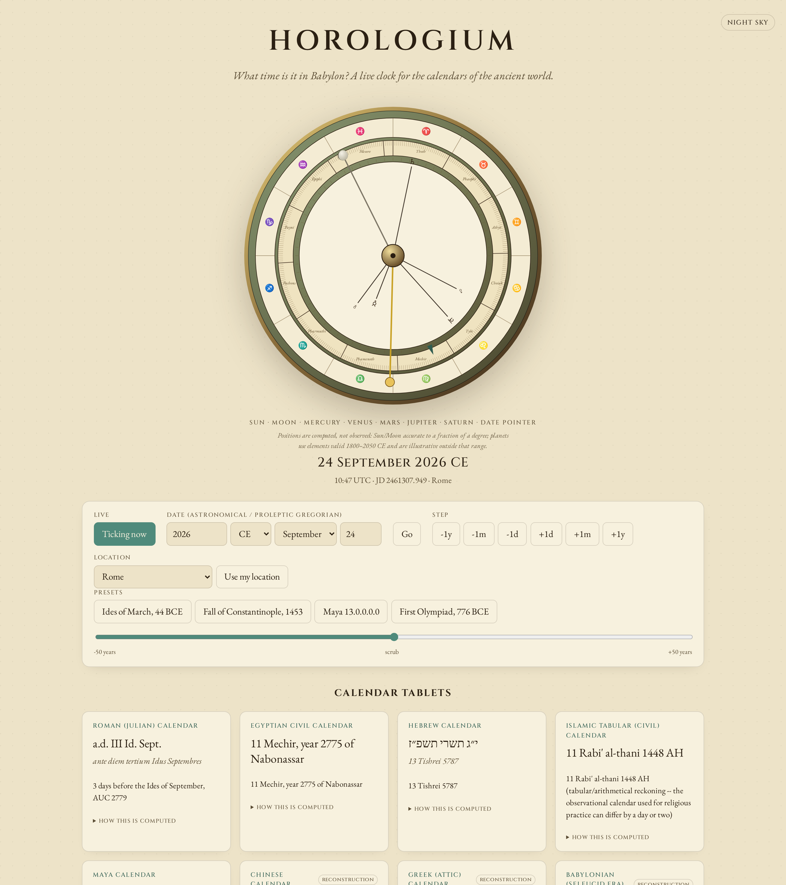
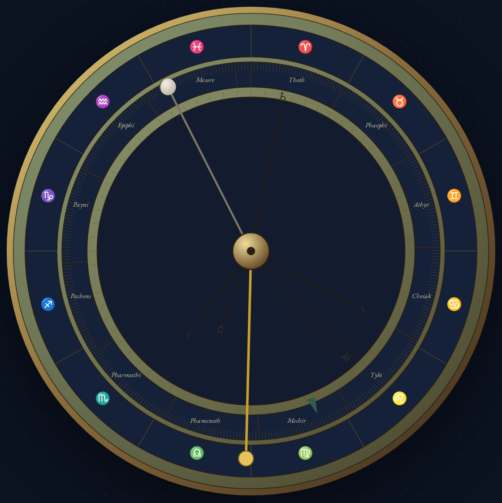

# Horologium

**What time is it in Babylon?** A live, Antikythera-inspired clock for the calendars of the ancient world — and a small, tested TypeScript library behind it.

[](LICENSE)
[](https://antonsoo.github.io/horologium/)



## Why this exists

Every "world clock" on the web answers one question: what time is it in some
other *place*. None of them answer the question a historian, a classicist, or
someone building an ancient-languages app actually asks: what time is it in
some other *era*, reckoned the way the people living there reckoned it? "24
September 2026" is meaningless to a Roman, who wants "a.d. VIII Kal. Oct.,
AUC 2779"; to a rabbi of any century, who wants "13 Tishrei 5787"; to a
Maya astronomer-priest, who wants "13.0.13.17.5, 11 Chikchan, 18 Ch'en".

This project is a small, honest attempt at that: a calendar-conversion
library with real citations and real tests, driving a museum-quality
Antikythera-mechanism-style dial. It exists because I build
[PRAVIEL](https://github.com/antonsoo), an ancient-languages app, and wanted
to know this kind of thing was computed correctly rather than guessed at.

## Quickstart

```sh
git clone https://github.com/antonsoo/horologium.git
cd horologium
npm install && npm run dev
```

Open the printed `localhost` URL. That's the whole app, running locally with
hot reload.

To use the calendar library in your own project (nothing is published to
npm yet, so install straight from GitHub):

```sh
npm install github:antonsoo/horologium
```

```ts
import { maya, hebrew, core } from 'horologium';

const jd = core.gregorianToJD(2012, 12, 21);
maya.describe(jd).summary; // "Long Count 13.0.0.0.0, Tzolk'in 4 Ajaw, Haab' 3 K'ank'in"
hebrew.describe(jd).native; // "ח׳ טבת תשע״ג" (8 Tevet 5773)
```

See [`examples/basic-usage.mjs`](examples/basic-usage.mjs) for a runnable version (`npm run build:lib && node examples/basic-usage.mjs`).

## Features

- **13 calendar systems** with real epochs, real leap-year/intercalation
  rules, and native-script rendering where it applies: Julian Day and the
  proleptic Gregorian/Julian calendars, Roman (Kalends/Nones/Ides, AUC,
  Roman numerals, seasonal hours), Byzantine Anno Mundi + Indiction,
  Islamic tabular, Coptic, Ethiopian, Hebrew (exact molad/dehiyyot
  arithmetic), Egyptian civil (+ Sothic cycle), Maya (Long Count/Tzolk'in/
  Haab'/Lord of the Night, with SVG bar-and-dot numerals), Chinese
  (sexagenary cycle + astronomically-computed lunisolar calendar),
  Zoroastrian (Yazdegerdi), Greek (Attic months + Olympiad reckoning, with
  polytonic Greek month names), and Babylonian (Seleucid Era).
- **Astronomy**: Sun/Moon position and phase, the tropical zodiac, the five
  naked-eye planets (Standish/JPL Keplerian elements), and the Metonic/
  Callippic/Saros/Exeligmos cycles behind the Antikythera mechanism's back
  dials.
- **A bronze, animated dial** — zodiac ring, Egyptian 365-day ring, Sun/Moon
  (with a half-silvered phase ball)/five-planet/date pointers — plus a back
  dial with the Metonic and Saros spirals.
- **Time travel**: BCE-capable date entry (astronomical year numbering under
  the hood), a year scrubber, day/month/year stepping, four historical
  presets, and a URL permalink.
- **Location**: eight ancient cities (Rome, Athens, Alexandria, Babylon,
  Jerusalem, Chang'an, Tikal, Tenochtitlan) plus geolocation, feeding real
  sunrise/sunset for Roman seasonal hours.
- **Light and dark themes** ("papyrus" and "night sky"), responsive to phone
  width, keyboard-accessible, no tracking, and a ~19 KB gzipped JS bundle
  (measured with `npm run build`; no framework, no charting library, no
  analytics).



## Usage examples

```ts
import { roman, chinese, egyptian, core } from 'horologium';

// The Roman calendar is Julian, not Gregorian - use julianToJD for a date
// given in the calendar the Romans themselves used.
const ides = core.julianToJD(-43, 3, 15); // 15 March 44 BCE Julian, astronomical year -43
roman.describe(ides);
// {
//   native: 'Id. Mart.',
//   transliteration: 'Idibus Martiis',
//   summary: 'The Ides of March, AUC 710',
//   ...
// }

chinese.describe(core.dateToJD(new Date()));
// { native: '丙午年 八月十四 (壬子日)', summary: 'Year of the Horse (Fire), 2026; ...' }

egyptian.sothicCyclePosition(ides);
// { yearsIntoCycle: 1278, cycleAnchorCE: 139 } - see docs/CALENDARS.md for the caveat
```

Every calendar's `describe(jd)` returns a `CalendarTablet` — `native`,
`transliteration`, `summary`, and a `method` string explaining exactly how
the date was computed (the same text the web app shows under "How this is
computed").

## How it works

- **Everything is keyed on Julian Day** (fractional, UTC), using
  **astronomical year numbering** (year 0 = 1 BCE). `src/lib/core/jd.ts` is
  the only place proleptic Gregorian/Julian arithmetic lives; every other
  calendar converts to/from JD.
- **Calendrical arithmetic** follows Edward M. Reingold & Nachum Dershowitz,
  *Calendrical Calculations: The Ultimate Edition* (Cambridge University
  Press, 2018) — reimplemented from first principles, not copied, and cited
  per-function in the source.
- **Astronomy** follows Jean Meeus, *Astronomical Algorithms*, 2nd ed.
  (Willmann-Bell, 1998) for the Sun/Moon, and E.M. Standish (JPL/Caltech),
  *Keplerian Elements for Approximate Positions of the Major Planets*, for
  the five naked-eye planets. New moons and solar terms are **root-found**
  on these same formulas (bisection on solar/lunar longitude), not read
  from Meeus's separate, more precise periodic-term tables — this keeps
  every derived quantity (a new moon, a solstice, a Chinese month boundary)
  internally consistent with everything else the library computes.
- **The full breakdown** — epoch, structure, rules, sources, and measured
  accuracy for all 13 calendars and the astronomy module — is in
  [`docs/CALENDARS.md`](docs/CALENDARS.md).
- **The web app** (`src/app/`) is plain TypeScript and hand-built SVG: no UI
  framework, no charting library. The front dial and back dial are built
  once as DOM nodes and updated in place (pointer rotations, the moon-phase
  path) on every tick or date change.

## Accuracy and limitations

- Calendars that are pure arithmetic (Roman, Byzantine, Islamic, Coptic,
  Ethiopian, Hebrew, Egyptian civil, Maya, Zoroastrian) are **exact** — no
  floating-point astronomy involved. Four of them (Hebrew, Islamic, Coptic,
  Maya) are cross-checked against an independent third-party
  implementation (Python's `convertdate`) across hundreds of dates each;
  see `tests/oracle-fixtures.test.ts` and `scripts/generate_fixtures.py`.
  `convertdate` has no Roman, Byzantine, Ethiopian, Egyptian-civil, or
  Zoroastrian module to check against, so those instead get hand-derived
  epoch verification and independent reference-fact checks (e.g. Ethiopian
  New Year's well-known ~11 September date) — see each module's own tests
  and `docs/CALENDARS.md`.
- The **Chinese**, **Greek (Attic)**, and **Babylonian** lunisolar
  calendars are explicit reconstructions (real historical calendars were
  set by observation and, for Babylon and Athens, irregular official
  decree, not a fixed formula). Chinese is cross-checked against
  `lunardate` for Chinese New Year every year 2000-2030 (max deviation 0.7
  days) and for 447 month/leap-month boundaries 2000-2035 (98.2%
  agreement; the 8 disagreements are understood and documented in
  `docs/CALENDARS.md`, including a genuinely disputed year, 2033, where
  real implementations differ from each other). Greek and Babylonian have
  no independent oracle available, so their tests instead sweep thousands
  of dates checking internal consistency (valid month/day ranges, no
  boundary discontinuities) — a real bug caught this way, and fixed, is
  documented in `babylonian.ts` and its test file.
- **Sun/Moon/planet positions** are measured (not just asserted) against
  Skyfield + the JPL DE421 ephemeris over 1900-2053: Sun within 0.006
  degrees, Moon within 0.68 degrees, planets within ~1.5 degrees. Planetary
  elements are only valid 1800-2050 CE by their source's own statement;
  outside that (and for all astronomy across the project's full ±5000-year
  date range) treat positions as illustrative, not precise — this is stated
  in the UI wherever it applies.
- **Roman seasonal hours** depend on sunrise/sunset, computed with no
  Delta-T correction (Earth's rotation has slowed over millennia; this
  isn't modeled), so ancient hour boundaries drift by unquantified minutes
  over long timescales.
- **Not implemented**: Aztec/Mexica and Hindu calendars — see the end of
  `docs/CALENDARS.md` for why (in short: the brief itself says to cut
  Aztec without a verifiable correlation constant, and Hindu was an
  explicit stretch goal).
- Tests: 100 tests across 13 files (`npm test`), including round-trip
  property tests (`toJD(fromJD(jd)) === jd`) spanning roughly ±5000 years
  per invertible calendar, and well over 1,600 individual oracle-fixture
  comparisons.

## Contributing

See [`CONTRIBUTING.md`](CONTRIBUTING.md). Short version: `npm install`,
`npm test`, `npm run lint`, `npm run typecheck` before opening a PR; cite
your source for any new calendar rule.

## License

[MIT](LICENSE) © 2026 Anton Soloviev. Bundled font (Cinzel, Cormorant
Garamond, EB Garamond) via Google Fonts, each under the SIL Open Font
License; no font files are vendored in this repository.

---

<sub>Part of [Officina](https://antonsoo.github.io/officina/), a set of small open-source tools by [Anton Soloviev](https://github.com/antonsoo).</sub>
