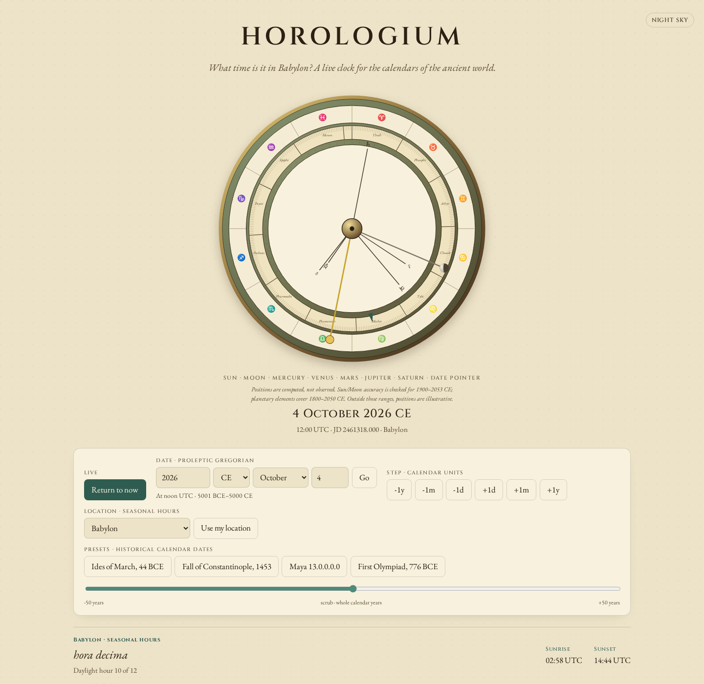
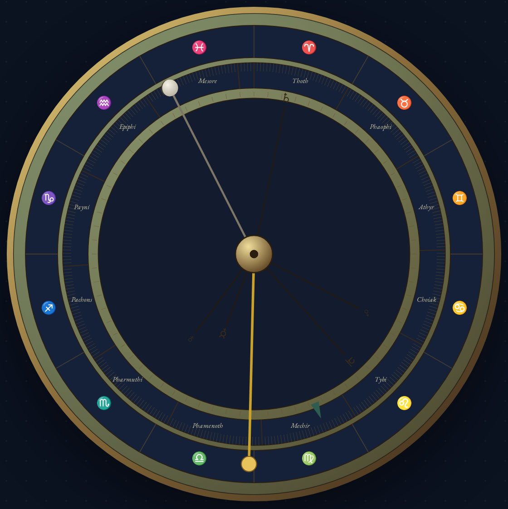

# Horologium

**What time is it in Babylon?** A live, Antikythera-inspired clock for the calendars of the ancient world — and a small, tested TypeScript library behind it.

[](https://www.npmjs.com/package/@antonsoloviev/horologium)
[](LICENSE)
[](https://antonsoo.github.io/horologium/)



## Why this exists

A date can change its meaning when its calendar is left unstated. The Ides
of March, 44 BCE are a Julian date, not a proleptic Gregorian one. In a
Chinese leap year, a month number can occur twice: 2033 has both a regular
and a leap month 11.

Horologium moves one instant through these different reckonings. Each
calendar names its method and marks projections outside its historical
era. The Chinese lunar-year inspector shows the month boundaries and
solar terms behind a leap-month decision. The arithmetic and astronomical
limits are documented alongside the results.

## Quickstart

```sh
git clone https://github.com/antonsoo/horologium.git
cd horologium
npm install && npm run dev
```

Open the printed `localhost` URL. That's the whole app, running locally with
hot reload.

To use the calendar library in your own project:

```sh
npm install @antonsoloviev/horologium
```

```ts
import { maya, hebrew, core } from '@antonsoloviev/horologium';

const jd = core.gregorianToJD(2012, 12, 21);
maya.describe(jd).summary; // "Long Count 13.0.0.0.0, Tzolk'in 4 Ajaw, Haab' 3 K'ank'in"
hebrew.describe(jd).native; // "ח׳ טבת תשע״ג" (8 Tevet 5773)
```

See [`examples/basic-usage.mjs`](examples/basic-usage.mjs) for a runnable version (`npm run build:lib && node examples/basic-usage.mjs`).

## Features

- **13 calendar systems** with real epochs, real leap-year/intercalation
  rules, and native-script rendering where it applies: Julian Day and the
  proleptic Gregorian/Julian calendars, Roman (Kalends/Nones/Ides, AUC,
  Roman numerals, seasonal hours), Byzantine Anno Mundi + Indiction,
  Islamic tabular, Coptic, Ethiopian, Hebrew (exact molad/dehiyyot
  arithmetic), Egyptian civil (+ Sothic cycle), Maya (Long Count/Tzolk'in/
  Haab'/Lord of the Night, with SVG bar-and-dot numerals), Chinese
  (sexagenary cycle + astronomically-computed lunisolar calendar),
  Zoroastrian (Yazdegerdi), Greek (Attic months + Olympiad reckoning, with
  polytonic Greek month names), and Babylonian (Seleucid Era).
- **Astronomy**: Sun/Moon position and phase, the tropical zodiac, the five
  naked-eye planets (Standish/JPL Keplerian elements), and the Metonic/
  Callippic/Saros/Exeligmos cycles behind the Antikythera mechanism's back
  dials.
- **A bronze, animated dial** — zodiac ring, Egyptian 365-day ring, Sun/Moon
  (with a half-silvered phase ball)/five-planet/date pointers — plus a back
  dial with the Metonic and Saros spirals.
- **Time travel**: BCE-capable date entry (astronomical year numbering under
  the hood), a year scrubber, exact civil day/month/year stepping, four
  historical presets, and live or paused URL permalinks. Impossible dates
  show a recoverable error; live ticks preserve unfinished date edits and
  open calendar explanations.
- **Chinese lunar-year inspection**: month boundaries, 29/30-day lengths,
  principal solar terms, and the reason a month is regular or intercalary.
  Jump to a month, inspect approximate event times, and download the year's
  evidence as JSON. [Calculation and verification](docs/chinese-calendar.md).
  These corrections and the inspector are in source, pending release.
- **Location**: eight ancient cities (Rome, Athens, Alexandria, Babylon,
  Jerusalem, Chang'an, Tikal, Tenochtitlan) plus cancellable geolocation,
  feeding a visible approximate sunrise/sunset and Roman seasonal-hour
  readout. Personal coordinates stay in the current tab; their links
  explicitly fall back to Rome.
- **Light and dark themes** ("papyrus" and "night sky"), responsive to phone
  width, keyboard-accessible, no tracking, and a ~29 KB gzipped JS bundle
  (measured with `npm run build`; no framework, no charting library, no
  analytics).



See [the clock controls and link behavior](docs/clock.md), including month-end
clamping, BCE dates and the browser's 5001 BCE–5000 CE input range.

## Usage examples

```ts
import { roman, egyptian, core } from '@antonsoloviev/horologium';

// The Roman calendar is Julian, not Gregorian - use julianToJD for a date
// given in the calendar the Romans themselves used.
const ides = core.julianToJD(-43, 3, 15); // 15 March 44 BCE Julian, astronomical year -43
roman.describe(ides);
// {
//   native: 'Id. Mart.',
//   transliteration: 'Idibus Martiis',
//   summary: 'The Ides of March, AUC 710',
//   ...
// }

egyptian.sothicCyclePosition(ides);
// { yearsIntoCycle: 1278, cycleAnchorCE: 139 } - see docs/CALENDARS.md for the caveat
```

For the corrected Chinese calendar, build this source revision with
`npm run build:lib`; the registry release does not yet include these changes:

```js
import { chinese, core } from './dist/lib/index.js';

chinese.describe(core.gregorianToJD(2026, 9, 24)).native;
// '丙午年 八月十四 (辛丑日)'
chinese.inspectChineseYear(2033).months.filter((month) => month.isLeapMonth).map((month) => month.month);
// [11]
```

Every calendar's `describe(jd)` returns a `CalendarTablet` — `native`,
`transliteration`, `summary`, and a `method` string explaining exactly how
the date was computed (the same text the web app shows under "How this is
computed"). A date before the calendar's own starting point (the Hijra for
the Islamic calendar, 3761 BCE for the Hebrew, the 45 BCE reform for the
Roman, and so on) also carries a `proleptic` note saying the year is counted
backward from it; the app shows it as a "proleptic" badge on the tablet.

## How it works

- **Everything is keyed on Julian Day** (fractional, UTC), using
  **astronomical year numbering** (year 0 = 1 BCE). `src/lib/core/jd.ts` is
  the only place proleptic Gregorian/Julian arithmetic lives; every other
  calendar converts to/from JD.
- **Calendrical arithmetic** follows Edward M. Reingold & Nachum Dershowitz,
  *Calendrical Calculations: The Ultimate Edition* (Cambridge University
  Press, 2018) — reimplemented from first principles, not copied, and cited
  per-function in the source.
- **Astronomy** follows Jean Meeus, *Astronomical Algorithms*, 2nd ed.
  (Willmann-Bell, 1998) for the Sun/Moon, and E.M. Standish (JPL/Caltech),
  *Keplerian Elements for Approximate Positions of the Major Planets*, for
  the five naked-eye planets. The illustrative Sun/Moon
  pointers and the Greek/Babylonian reconstructions use the shared
  low-precision longitude formulas. The Chinese calendar uses a separate
  Meeus chapter 49 new-moon series and an explicit TT-to-UT time conversion
  before assigning events to UTC+8 civil days. Event times remain
  approximate; they are not observations.
- **The full breakdown** — epoch, structure, rules, sources, and measured
  accuracy for all 13 calendars and the astronomy module — is in
  [`docs/CALENDARS.md`](docs/CALENDARS.md).
- **The web app** (`src/app/`) is plain TypeScript and hand-built SVG: no UI
  framework, no charting library. The front dial and back dial are built
  once as DOM nodes and updated in place (pointer rotations, the moon-phase
  path) on every tick or date change. Calendar tablets also update in place
  so their disclosures and keyboard focus survive the fifteen-second tick.

## Accuracy and limitations

- Calendars that are pure arithmetic (Roman, Byzantine, Islamic, Coptic,
  Ethiopian, Hebrew, Egyptian civil, Maya, Zoroastrian) are **exact** — no
  floating-point astronomy involved. Four of them (Hebrew, Islamic, Coptic,
  Maya) are cross-checked against an independent third-party
  implementation (Python's `convertdate`) across hundreds of dates each;
  see `tests/oracle-fixtures.test.ts` and `scripts/generate_fixtures.py`.
  `convertdate` has no Roman, Byzantine, Ethiopian, Egyptian-civil, or
  Zoroastrian module to check against, so those instead get hand-derived
  epoch verification and independent reference-fact checks (e.g. Ethiopian
  New Year's well-known ~11 September date) — see each module's own tests
  and `docs/CALENDARS.md`.
- **Chinese calendar**: the source revision matches all 62,821 available
  daily month/day/year records in Hong Kong Observatory's 1929–2100 tables,
  checked at local midnight, noon and the final second. The original source
  disagreed on 1,315 of those dates. This is a modern-rule calculation in
  UTC+8, not a historical-calendar archive: three pre-1929 months still
  differ from the published historical dates, and future events close to
  midnight can change civil day. Ten principal-solar-term dates in the
  wider 1901–2099 lunar-year inspection differ from HKO; the event model is
  approximate. [Full study, source gaps and limits](studies/chinese-calendar/README.md).
- **Greek (Attic)** and **Babylonian** lunisolar dates are explicit
  reconstructions. Historical calendars were set by observation and
  official decree. They have no independent oracle here; tests check
  internal consistency across thousands of dates. That is weaker evidence
  than comparison with published historical calendars.
- **Sun/Moon/planet positions** are measured (not just asserted) against
  Skyfield + the JPL DE421 ephemeris over 1900-2053: Sun within 0.006
  degrees, Moon within 0.68 degrees, planets within ~1.5 degrees. Planetary
  elements are only valid 1800-2050 CE by their source's own statement;
  outside that (and for all astronomy across the project's full ±5000-year
  date range) treat positions as illustrative, not precise — this is stated
  in the UI wherever it applies.
- **Roman seasonal hours** depend on sunrise/sunset, computed with no
  Delta-T correction (Earth's rotation has slowed over millennia; this
  isn't modeled), so ancient hour boundaries drift by unquantified minutes
  over long timescales.
- **Not implemented**: Aztec/Mexica and Hindu calendars — see the end of
  `docs/CALENDARS.md` for why (in short: the brief itself says to cut
  Aztec without a verifiable correlation constant, and Hindu was an
  explicit stretch goal).
- Dates before a calendar's era are computed by running its rules
  backward, and the years come out zero or negative ("-1670 AH"). Those
  tablets are marked "proleptic", with a note naming where the count really
  starts: nobody wrote those years.
- Tests (`npm test`), including round-trip
  property tests (`toJD(fromJD(jd)) === jd`) spanning roughly ±5000 years
  per invertible calendar, and well over 1,600 individual oracle-fixture
  comparisons.

## Contributing

See [`CONTRIBUTING.md`](CONTRIBUTING.md). Short version: `npm install`,
`npm test`, `npm run lint`, `npm run typecheck` before opening a PR; cite
your source for any new calendar rule.

## License

[MIT](LICENSE) © 2026 Anton Soloviev. The clock page's fonts (Cinzel,
Cormorant Garamond, EB Garamond) are in `src/app/fonts/`, each under the SIL
Open Font License ([`LICENSE.txt`](src/app/fonts/LICENSE.txt) there); the page
serves them itself and asks no other host for anything. The new-moon
series adapts MIT-licensed code by Sonia Keys and Commenthol; see
[third-party notices](THIRD_PARTY_NOTICES.md).

---

<sub>Part of [Officina](https://antonsoo.github.io/officina/), a set of small open-source tools by [Anton Soloviev](https://github.com/antonsoo).</sub>
