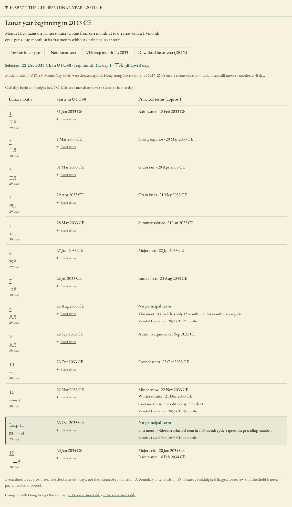
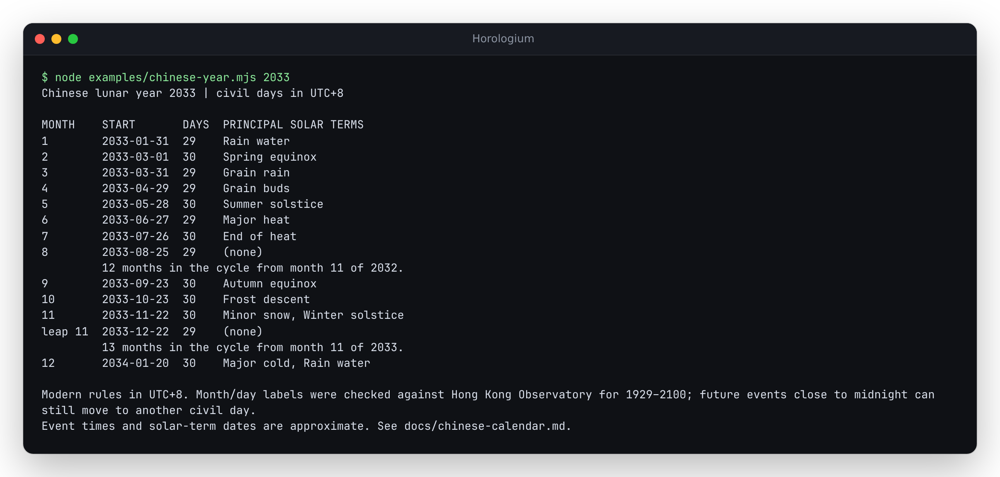
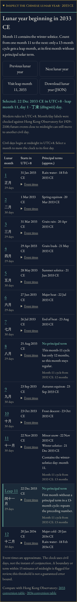

# Inspecting the Chinese lunar year

These corrections and the inspector are in source, pending publication.

The Chinese tablet's **Inspect months and leap rule** button opens a year
ledger. Its dates use UTC+8 even when the astronomical clock's editor shows
UTC or another ancient city is selected. Selecting a month moves the clock
to local noon on its first day and updates the normal time permalink.
Previous/next controls visit the first day of the adjacent lunar year.
Event disclosures stay open when the date changes within the same year.

The 2033 example is useful because an empty solar-term column alone does
not identify a leap month:

| Month beginning in UTC+8 | Label | Principal terms | Month-11 cycle |
| --- | --- | --- | --- |
| 25 August 2033 | 8, regular | None | 12 months: no intercalation |
| 22 November 2033 | 11, regular | Minor snow; winter solstice | 13 months |
| 22 December 2033 | 11, leap | None | First empty month in that 13-month cycle |
| 20 January 2034 | 12, regular | Major cold; rain water | Same 13-month cycle |

This agrees with [HKO's 2033 table](https://www.hko.gov.hk/en/gts/time/calendar/text/files/T2033e.txt)
and [2034 table](https://www.hko.gov.hk/en/gts/time/calendar/text/files/T2034e.txt).
The previous implementation's leap month 7 was a calculation error. Its
test tolerated the disagreement and its documentation incorrectly presented
that disagreement as sufficient justification for the result.



## Library and downloads

Build the source library and run the example:

```sh
npm ci
npm run build:lib
node examples/chinese-year.mjs 2033
```



`node examples/chinese-year.mjs 2033 --json` emits the same data as the
browser's **Download lunar year (JSON)** button. The download is a snapshot
of the displayed year, independent of subsequent clock changes. No data
leaves the browser. The public API, after a source build, is:

```js
import { chinese, core } from './dist/lib/index.js';

const year = chinese.inspectChineseYear(2033);
console.log(year.months.filter((month) => month.isLeapMonth).map((month) => month.month));
// [11]
console.log(core.jdToDate(chinese.chineseNewYear(2027)).toISOString());
// 2027-02-05T16:00:00.000Z -- midnight at the start of 6 February in UTC+8
```

| Field | Meaning |
| --- | --- |
| `schemaVersion` | Inspection format version, currently 1 |
| `basis`, `clock`, `note` | Modern-rule calculation, UTC+8, and the date-range limitation |
| `eventTimeNote` | Approximate TT-to-UT model; no guarantee of future UTC dates |
| `startJD`, `endJD` | Inclusive/exclusive civil midnights, expressed as UTC JD values |
| `months[].month`, `isLeapMonth`, `days` | Month number, intercalary status, civil length |
| `newMoonJD`, `nextNewMoonJD` | Approximate conjunction instants bounding that month |
| `principalTerms` | Approximate event instants, longitudes and names within its civil bounds |
| `solsticeYear`, `monthsInSolsticeCycle`, `rule` | The cycle and reason used to number the month |
| `nearMidnight` | Events within `nearMidnightThresholdMinutes` (15) of local midnight |

The returned records can be edited by a consumer without changing cached
calculations. `chineseNewYear` now returns **civil midnight**, correcting
its earlier conjunction-instant behavior. Use the first inspection month's
`newMoonJD` if you need the conjunction estimate. New Year/date conversion
accept -5000–5000; inspection also accepts -5001 to cover the lunar year
overlapping the clock's earliest Gregorian dates. Inputs use astronomical
year numbering, so year 0 is 1 BCE. Invalid inputs throw `RangeError`.

## What the evidence establishes

The [source study](../studies/chinese-calendar/README.md) checks published
daily labels, local-midnight behavior, complete year exports, and event
timings against an independently integrated JPL ephemeris.

Month/day/year labels agree with all 62,821 available HKO daily records
from 1929–2100. This does not make historical projections authoritative:
HKO's 1914, 1916 and 1920 historical month starts differ from a fixed-UTC+8
calculation. Earlier Chinese calendars used different rules and clocks.
The inspector keeps that qualification next to historical results.

Principal-term dates and times are approximate. Ten term dates in the
wider comparison differ from HKO, including six after 1928. All six modern
differences trigger the near-midnight flag. A flag asks for closer review;
absence of a flag is not a guarantee, particularly outside the measured
1900–2100 event range. HKO itself notes possible future one-day shifts
for near-midnight events on its [conversion page](https://www.hko.gov.hk/en/gts/time/conversion.htm).

The Chinese calendar's phase calculation is separate from the
illustrative Moon pointer and Greek/Babylonian reconstructions. Their
existing lower-precision phase functions do not define Chinese months.


