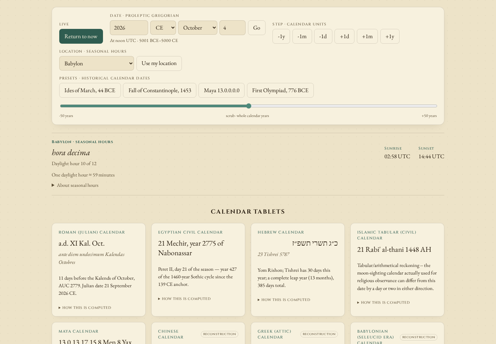
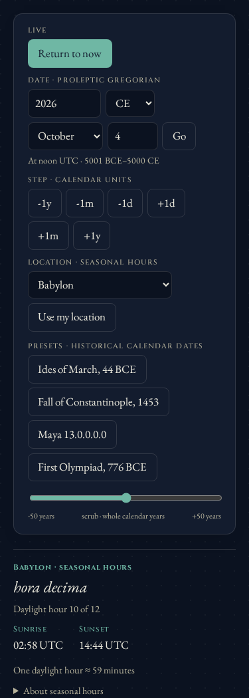

# Using the clock

The date readout, astronomical dials and twelve calendar tablets all refer to
the same instant. The seasonal-hour panel adds the selected location's solar
time. Calendar dates remain keyed on UTC; choosing a city does not turn them
into a local civil timezone or model sunset-based religious date boundaries.

## Date entry and travel

Enter a positive whole year, choose CE or BCE, select a month and enter a
whole day. **Go** or Enter travels to **12:00 UTC** on that proleptic Gregorian
date. There is no displayed year zero: 1 BCE is astronomical year 0.

The browser accepts dates from **5001 BCE through 5000 CE**, inclusive.
Impossible dates (31 February), empty fields, fractional values and dates
outside this range produce an error while retaining the previous result.
The library can be used independently of this browser input bound; it is
not a claim that reconstructed calendars or astronomy are accurate across
that entire period. See [accuracy and sources](CALENDARS.md).

Day steps move by one UTC day. Month and year steps preserve the time of day
and clamp to the last day of a shorter destination month: 31 January 2024
at noon becomes 29 February at noon, then a year step becomes 28 February
2025 at noon. Moving back does not reconstruct the original longer-month
day. The year scrubber computes every value from the date at the start of
its gesture, so scrubbing away from and back to a leap day restores it.
Releasing the pointer or leaving the slider recenters it on the new date.

Historical presets use the calendar specified by the event: the Ides of
March, fall of Constantinople and first Olympiad are Julian; Maya 13.0.0.0.0
is Gregorian. The editor shows their equivalent proleptic Gregorian date.

**Return to now** resumes the fifteen-second live refresh. Live refreshes
leave unfinished date entries, expanded explanations and keyboard focus
alone. An invalid draft never changes the displayed calendar result.

## Links and location

Copy the address bar after using a control. A paused link stores its complete
fractional Julian day and city; a live link stores the live mode and city,
so reopening it shows the new current instant. Browser back/forward
navigation among time hashes updates the controls and results. Malformed,
duplicate, excessive or out-of-range link values show a recovery message.

The eight public cities can be shared. **Use my location** asks the browser
for a position; it is kept only in the current tab. **Cancel location**, a
new request, choosing another city, or loading another time hash makes the
old request inactive. A late answer remains usable after the unanswered
notice only while that request still owns the selection.

A personal-location link uses `loc=private` and no coordinates. Reopening
it selects Rome and explicitly explains that the original coordinates
remain private to their original tab. Legacy `loc=My+location` links have
the same explained fallback. No geolocation requests start automatically.

## Seasonal time

The panel shows a Roman daylight hour (twelve divisions from sunrise to
sunset) or night watch (four divisions from sunset to the next sunrise).
Their lengths depend on location and season. It also shows the sunrise
and sunset of the solar day nearest the current instant, in UTC, with
`+1 day` or `-1 day` when an event lies on a neighboring UTC date.

The implementation searches neighboring solar days to avoid mistaking an
eastern dawn or western afternoon for a night watch. Polar conditions
without the needed boundaries show an unavailable hour; the library's
placeholder label is never presented as a measured hour.

These are approximate modeled boundaries. Elevation, varying refraction
and Delta-T are omitted; ancient-hour drift is unquantified. The new tests
check interval ownership and display behavior, not independently measured
sunrise accuracy.

## Chinese lunar year

The Chinese tablet's **Inspect months and leap rule** button opens a
year ledger with civil month boundaries, leap-month reasoning and
approximate astronomical events. Month buttons move the clock to local
noon on their first day and retain the usual time permalink. All Chinese
date parts use midnight in UTC+8, independently of the selected ancient
city. See [the inspection guide](chinese-calendar.md) for JSON downloads,
the 2033 example and the measured limits.

